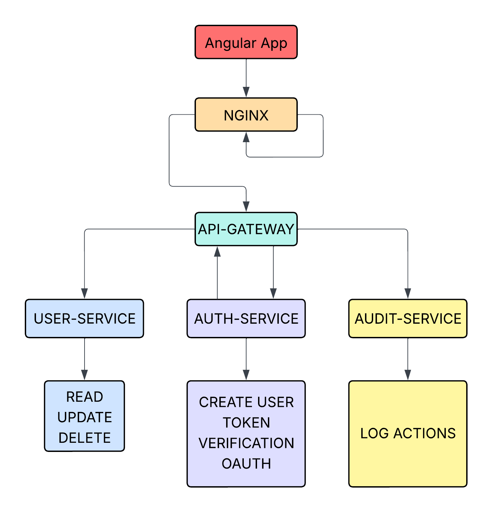
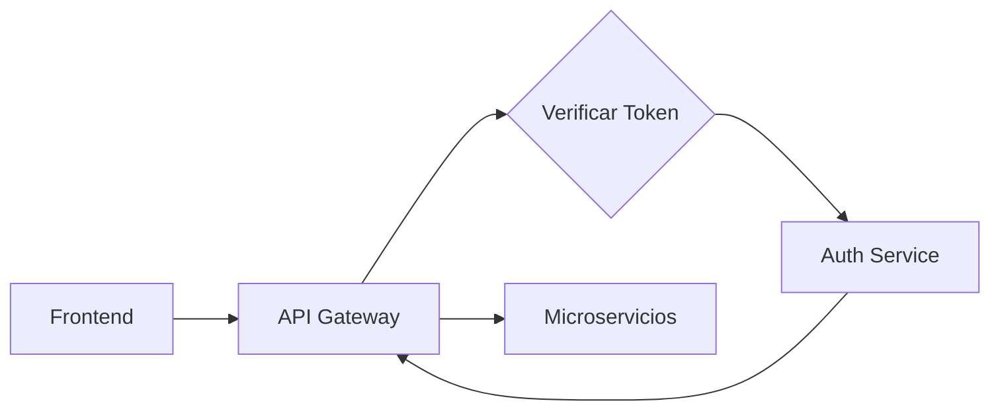
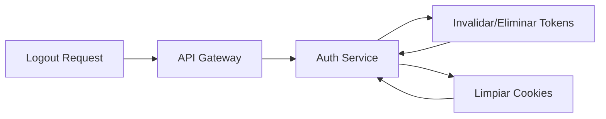

# AuthenticApp - Sistema de Autenticación Segura

Un **sistema de autenticación basado en microservicios** con un frontend en **Angular**, desarrollado con **Go** y **PostgreSQL**.

---

## 🚀 Inicio Rápido

### Prerrequisitos

* Docker
* Docker Compose

### Desarrollo Local

1. Clona este repositorio
2. Ejecuta:

   ```bash
   docker-compose up -d --build
   ```
3. Accede a:

   * Frontend → [http://localhost:4200](http://localhost:4200)
   * API Gateway → [http://localhost:8888](http://localhost:8888)

---

## 🧩 Servicios

| Servicio          | Puerto | Descripción                                                          |
| ----------------- | ------ | ---------------------------------------------------------------------|
| **API Gateway**   | 8888   | Enruta solicitudes, maneja CORS y protección CSRF                    |
| **Auth Service**  | 9999   | Autenticación JWT, gestión de usuarios y recuperacion de contraseña  |
| **User Service**  | 8889   | Operaciones sobre datos de usuario                                   |
| **Audit Service** | 8890   | Registro de actividades                                              |
| **PostgreSQL**    | 5432   | Almacenamiento de datos                                              |

---

## 👤 Administrador Predeterminado

* **Usuario:** `admin123`
* **Correo:** `admin@gmail.com`

---

## 🏗 Arquitectura

```
Angular Frontend → API Gateway → Auth Service / User Service / Audit Service → PostgreSQL
```

---

## 🔧 Despliegue

### Producción

```bash
docker-compose up -d 
```

---

# Arquitectura del Sistema


## Stack Tecnológico
- __Frontend__: Angular con Tailwind CSS  
- __Backend__: Microservicios en Go  
- __API Gateway__: Go con Gorilla Mux  
- __Base de Datos__: PostgreSQL con claves primarias UUID  
- __Autenticación__: 
  - Tokens JWT con protección CSRF
  - OAuth 2.0 / OpenID Connect para proveedores externos
- __Contenerización__: Docker y Docker Compose  

## Seguridad
- Hashing de contraseñas con sal  
- Autenticación basada en tokens JWT  
- OAuth 2.0 para integración con proveedores externos (Google)
- Protección CSRF  
- Registro de auditorías para todas las acciones  
- Validación de entradas y prevención de inyecciones SQL  

## Decisiones de Escalabilidad
- Arquitectura de microservicios para escalar de forma independiente  
- API Gateway para enrutamiento centralizado  
- Autenticación sin estado (stateless)  
- Despliegue contenerizado con Docker  

## Flujo de Autenticación OAuth

### Flujo Principal de Login
1. __Inicio con OAuth:__ Usuario selecciona "Login con Google/GitHub" en el frontend de Angular
2. __Redirección:__ Frontend redirige al usuario al endpoint de autorización del proveedor OAuth con `client_id`, `redirect_uri`, y `scope`
3. __Autorización:__ Usuario ingresa credenciales y autoriza los permisos solicitados en la página del proveedor (Google)
4. __Callback:__ Proveedor OAuth redirige de vuelta a nuestra aplicación con un `código de autorización` en la URL
5. __Intercambio de Token:__ El API Gateway recibe el código y lo envía al Auth Service, que lo intercambia por un `access_token` del proveedor
6. __Creación de Usuario:__ Auth Service obtiene el perfil del usuario del proveedor y crea/actualiza el usuario local en la base de datos
7. __JWT Generation:__ Auth Service genera un JWT interno para la sesión del usuario y lo retorna al frontend

### Verificación de Sesión


- __API Gateway__ intercepta todas las requests protegidas
- __Redirige al Auth Service__ para validar el JWT en cada request
- __Auth Service__ verifica la firma, expiración y estado del token
- Si el token es válido, el request continúa a los microservicios correspondientes


### Logout y Eliminación de Sesión


- __Frontend__ llama al endpoint de logout via API Gateway
- __Auth Service__ invalida tokens (JWT)
- __Elimina las cookies/session storage__ del frontend

### Ventajas de esta Arquitectura:
- __Centralización:__ Todas las verificaciones pasan por Auth Service
- __Seguridad:__ Tokens invalidables y verificación centralizada
- __Escalabilidad:__ Microservicios no necesitan lógica de autenticación
- __Mantenibilidad:__ Cambios en autenticación afectan solo un servicio
